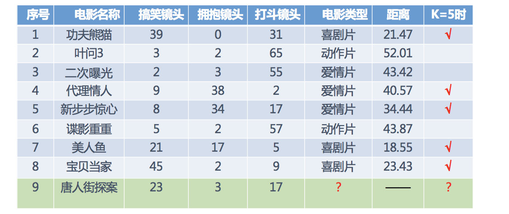
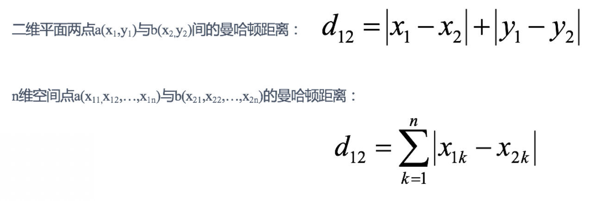
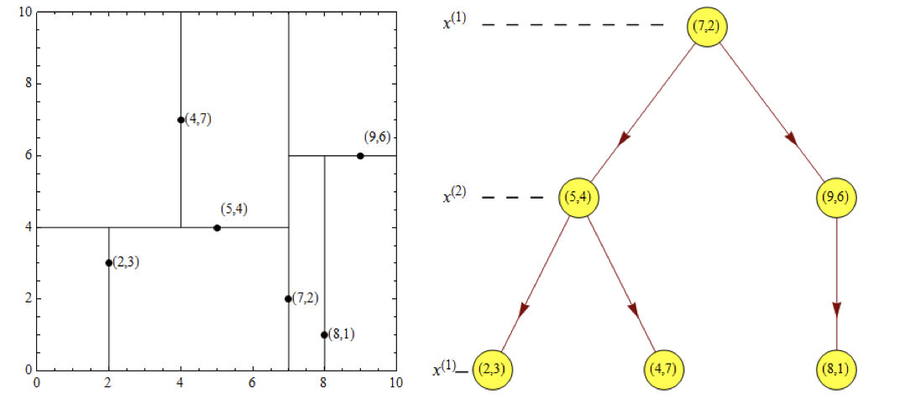
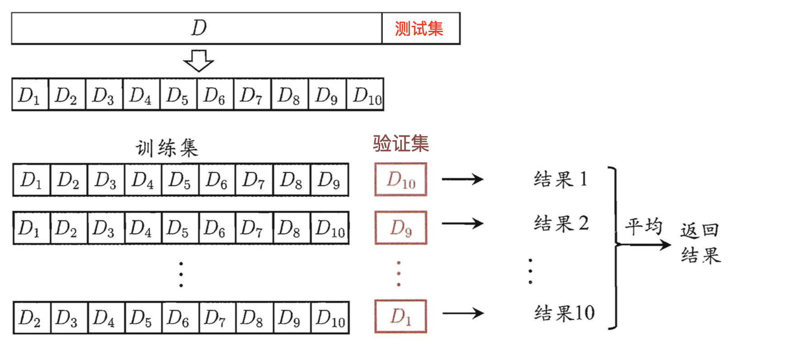

# KNN

## what is KNN
- 计算已知类别数据集中的点与当前点之间的距离
- 按距离递增次序排序
- 选取与当前点距离最小的k个点
- 统计前k个点所在的类别出现的频率
- 返回前k个点出现频率最高的类别作为当前点的预测分类

  
## Scikit-learn工具介绍

```angular2html
pip3 install scikit-learn==0.19.1
conda install scikit-learn==0.19.1
import sklearn
```
## 流程
- 1.获取数据集
- 2.数据基本处理（该案例中省略）
- 3.特征工程（该案例中省略）
- 4.机器学习
- 5.模型评估（该案例中省略）

## 距离定义

### 欧式距离


### 曼哈顿距离



### 切比雪夫距离


### 明科夫斯基距离


- 当p=1时，就是曼哈顿距离；

- 当p=2时，就是欧氏距离；

- 当p→∞时，就是切比雪夫距离。

### 以上距离公式的缺点
- (1)将各个分量的量纲(scale)，也就是“单位”相同的看待了;

- (2)未考虑各个分量的分布（期望，方差等）可能是不同的。


## K值选择说明
- K值过小：容易受到异常点的影响,模型会过于复杂,容易过拟合.
- k 过大,容易受样本均衡性影响,模型会太简单,欠拟合.

- 近似误差:训练集误差,太小容易过拟合.
- 估计误差:测试误差,这才是应该追求的

## kd 树
> kd树(K-dimension tree)是一种对k维空间中的实例点进行存储以便对其进行快速检索的树形数据结构。
> 针对N个样本，D个特征的数据集, 时间复杂度O（DNlog(N)

### 案例
- 给定一个二维空间数据集：T={(2,3),(5,4),(9,6),(4,7),(8,1),(7,2)}，构造一个平衡kd树。
x 轴:[2,9] y轴:[2,7]

  
#### 查找 (2.1,3.1) 


- 1. search_path中的结点为<(7,2),(5,4), (2,3)>，从search_path中取出(2,3)作为当前最佳结点nearest, dist为0.141；

- 2. 然后回溯至(5,4)，以(2.1,3.1)为圆心，以dist=0.141为半径画一个圆，并不和超平面y=4相交，如上图，所以不必跳到结点(5,4)的右子空间去搜索，因为右子空间中不可能有更近样本点了。

- 3. 于是再回溯至(7,2)，同理，以(2.1,3.1)为圆心，以dist=0.141为半径画一个圆并不和超平面x=7相交，所以也不用跳到结点(7,2)的右子空间去搜索。
    
- 4. 至此，search_path为空，结束整个搜索，返回nearest(2,3)作为(2.1,3.1)的最近邻点，最近距离为0.141。


#### 查找点(2,4.5)


- 1. search_path中的结点为<(7,2),(5,4), (4,7)>，从search_path中取出(4,7)作为当前最佳结点nearest, dist为3.202；

- 2. 然后回溯至(5,4)，以(2,4.5)为圆心，以dist=3.202为半径画一个圆与超平面y=4相交，所以需要跳到(5,4)的左子空间去搜索。所以要将(2,3)加入到search_path中，现在search_path中的结点为<(7,2),(2, 3)>；另外，(5,4)与(2,4.5)的距离为3.04 < dist = 3.202，所以将(5,4)赋给nearest，并且dist=3.04。

- 3. 回溯至(2,3)，(2,3)是叶子节点，直接平判断(2,3)是否离(2,4.5)更近，计算得到距离为1.5，所以nearest更新为(2,3)，dist更新为(1.5)

- 4. 回溯至(7,2)，同理，以(2,4.5)为圆心，以dist=1.5为半径画一个圆并不和超平面x=7相交, 所以不用跳到结点(7,2)的右子空间去搜索。
    
- 5. search_path为空，结束整个搜索，返回nearest(2,3)作为(2,4.5)的最近邻点，最近距离为1.5。

KD 树对于 20 维以下的数据,效率比较好,20 维以上的话,也效率欠佳.


# 训练集和测试集
必须是独立同分布的,且互斥.一般 有三种方法:

    - 留出法
    - 交叉检验法
    - 自助法
    
## 留出法(hold-out)
> 留出法”(hold-out)直接将数据集D划分为两个互斥的集合，其中一个集合作为训练集S，另一个作为测试集T

- 分层采样 stratified sampling: 确保训练集和测试集样本正负比例一致   
- 一般要采用若干次随机划分、重复进行实验评估后取平均值作为留出法的评估结果   

- train 太大,test 太小,会导致评估结果不稳定,不准确   
- train 太小,test 太大,会降低评估结果的准确性.   

```go
python 留出法代码
from sklearn.model_selection import train_test_split

train_X , test_X, train_Y ,test_Y = train_test_split(
        X, Y, test_size=0.2,random_state=0)
```

## 留一法( Leave-One-Out，简称LOO）

> 即每次抽取一个样本做为测试集。 
> 显然，留一法不受随机样本划分方式的影响，因为m个样本只有唯一的方式划分为m个子集一每个子集包含个样本

```
python 留一法代码
from sklearn.model_selection import LeaveOneOut

data = [1, 2, 3, 4]
loo = LeaveOneOut()
for train, test in loo.split(data):
    print("%s %s" % (train, test))
'''结果
[1 2 3] [0]
[0 2 3] [1]
[0 1 3] [2]
[0 1 2] [3]
'''
```

### 留一法优缺点
- 留一法使用的训练集与初始数据集相比只少了一个样本，这就使得在绝大多数情况下，留一法中被实际评估的模型与期望评估的用D训练出的模型很相似。因此，留一法的评估结果往往被认为比较准确。     
- 在数据集比较大时，训练m个模型的计算开销可能是难以忍受的(例如数据集包含1百万个样本，则需训练1百万个模型，而这还是在未考虑算法调参的情况下。


# 交叉验证法 k- fold cross validation
> “交叉验证法”( cross validation)先将数据集D划分为k个大小相似的互斥子集, 
> 每个子集都尽可能保持数据分布的一致性，即从D中通过分层抽样得到。




- KFold,StratifiedKFold
    - StratifiedKFold是分层采样，确保训练集，测试集中，各类别样本的比例是和原始数据集中的一致。
    - n_splits：表示划分几等份
    - shuffle：在每次划分时，是否进行洗牌 
    - split(X, y=None, groups=None)：将数据集划分成训练集和测试集，返回索引生成器
```angular2html
import numpy as np
from sklearn.model_selection import KFold,StratifiedKFold

X = np.array([
    [1,2,3,4],
    [11,12,13,14],
    [21,22,23,24],
    [31,32,33,34],
    [41,42,43,44],
    [51,52,53,54],
    [61,62,63,64],
    [71,72,73,74]
])

y = np.array([1,1,0,0,1,1,0,0])

folder = KFold(n_splits = 4, random_state=0, shuffle = False)
sfolder = StratifiedKFold(n_splits = 4, random_state = 0, shuffle = False)

for train, test in folder.split(X, y):
    print('train:%s | test:%s' %(train, test))
    print("")

for train, test in sfolder.split(X, y):
    print('train:%s | test:%s'%(train, test))
    print("")
```

结果: sfold进行4折计算时候，是平衡了测试集中，样本正负的分布的；但是fold却没有   
```angular2html
# 第一个for，输出结果为：
train:[2 3 4 5 6 7] | test:[0 1]

train:[0 1 4 5 6 7] | test:[2 3]

train:[0 1 2 3 6 7] | test:[4 5]

train:[0 1 2 3 4 5] | test:[6 7]

# 第二个for，输出结果为：
train:[1 3 4 5 6 7] | test:[0 2]

train:[0 2 4 5 6 7] | test:[1 3]

train:[0 1 2 3 5 7] | test:[4 6]

train:[0 1 2 3 4 6] | test:[5 7]
```

## 自助法( bootstrap sampling)
> 我们希望评估的是用D训练出的模型。但在留出法和交叉验证法中，由于保留了一部分样本用于测试，因此实际评估的模型所使用的训练集比D小，这必然会引入一些因训练样本规模不同而导致的估计偏差。   
> 留一法受训练样本规模变化的影响较小，但计算复杂度又太高了。
> 有没有什么办法可以减少训练样本规模不同造成的影响，同时还能比较高效地进行实验估计呢？    
> 直接以自助采样法( bootstrap sampling)为基础。给定包含m个样本的数据集D，我们对它进行采样产生数据集D':
> D中有一部分样本会在D′中多次出现，而另一部分样本不出现

- 每次随机从D中挑选一个样本，将其拷贝放入D'，然后再将该样本放回初始数据集D中，使得该样本在下次采样时仍有可能被到；
- 这个过程重复执行m次后，我们就得到了包含m个样本的数据集D′，这就是自助采样的结果。


> 通过自助采样，初始数据集D中约有36.8%的样本未出现在采样数据集D′中。    
> 我们可将D′用作训练集，D-D′用作测试集；这样，实际评估的模型与期望评估的模型都使用m个训练样本，而我们仍有数据总量约1/3的、没在训练集中出现的样本用于测试。


### 自助法优缺点：
- 优点
    - 自助法在数据集较小、难以有效划分训练/测试集时有优势
    - 自助法能从初始数据集中产生多个不同的训练集，这对集成学习等方法有很大的好处
- 缺点
    - 自助法产生的数据集改变了初始数据集的分布，这会引入估计偏差。因此，在初始数据量足够时；留出法和交叉验证法更常用一些
    
## 总结
- 数据量足够时，选择留出法简单省时，在牺牲很小的准确度的情况下，换取计算的简便
- 数据量较小时，我们应该选择交叉验证法，因为此时划分样本集将会使训练数据过少
- 数据量特别少的时候，我们可以考虑留一法
  


