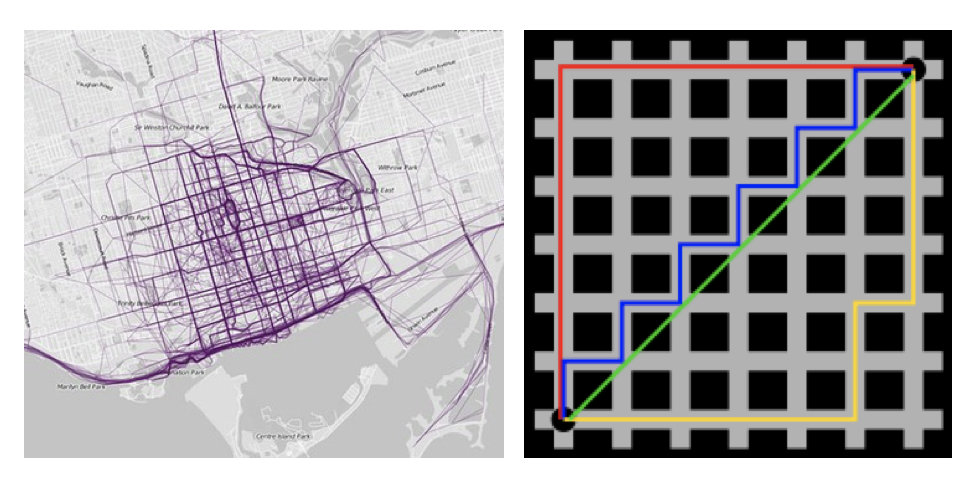
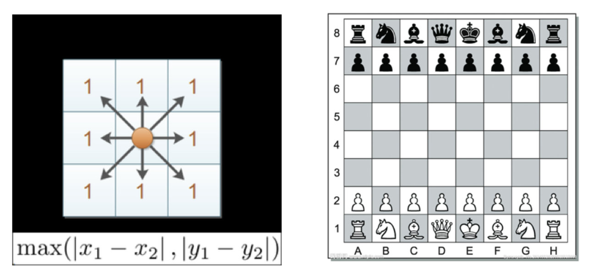

# KNN

## what is KNN
- 计算已知类别数据集中的点与当前点之间的距离
- 按距离递增次序排序
- 选取与当前点距离最小的k个点
- 统计前k个点所在的类别出现的频率
- 返回前k个点出现频率最高的类别作为当前点的预测分类

  
## Scikit-learn工具介绍

```angular2html
pip3 install scikit-learn==0.19.1
conda install scikit-learn==0.19.1
import sklearn
```
## 流程
- 1.获取数据集
- 2.数据基本处理（该案例中省略）
- 3.特征工程（该案例中省略）
- 4.机器学习
- 5.模型评估（该案例中省略）

## 距离定义

### 欧式距离


### 曼哈顿距离



### 切比雪夫距离



### 明科夫斯基距离


- 当p=1时，就是曼哈顿距离；

- 当p=2时，就是欧氏距离；

- 当p→∞时，就是切比雪夫距离。

### 以上距离公式的缺点
- (1)将各个分量的量纲(scale)，也就是“单位”相同的看待了;

- (2)未考虑各个分量的分布（期望，方差等）可能是不同的。


## K值选择说明
- K值过小：容易受到异常点的影响,模型会过于复杂,容易过拟合.
- k 过大,容易受样本均衡性影响,模型会太简单,欠拟合.

- 近似误差:训练集误差,太小容易过拟合.
- 估计误差:测试误差,这才是应该追求的

## kd 树
> kd树(K-dimension tree)是一种对k维空间中的实例点进行存储以便对其进行快速检索的树形数据结构。
> 针对N个样本，D个特征的数据集, 时间复杂度O（DNlog(N)

### 案例
- 给定一个二维空间数据集：T={(2,3),(5,4),(9,6),(4,7),(8,1),(7,2)}，构造一个平衡kd树。
x 轴:[2,9] y轴:[2,7]

  
#### 查找 (2.1,3.1) 


- 1. search_path中的结点为<(7,2),(5,4), (2,3)>，从search_path中取出(2,3)作为当前最佳结点nearest, dist为0.141；

- 2. 然后回溯至(5,4)，以(2.1,3.1)为圆心，以dist=0.141为半径画一个圆，并不和超平面y=4相交，如上图，所以不必跳到结点(5,4)的右子空间去搜索，因为右子空间中不可能有更近样本点了。

- 3. 于是再回溯至(7,2)，同理，以(2.1,3.1)为圆心，以dist=0.141为半径画一个圆并不和超平面x=7相交，所以也不用跳到结点(7,2)的右子空间去搜索。
    
- 4. 至此，search_path为空，结束整个搜索，返回nearest(2,3)作为(2.1,3.1)的最近邻点，最近距离为0.141。


#### 查找点(2,4.5)


- 1. search_path中的结点为<(7,2),(5,4), (4,7)>，从search_path中取出(4,7)作为当前最佳结点nearest, dist为3.202；

- 2. 然后回溯至(5,4)，以(2,4.5)为圆心，以dist=3.202为半径画一个圆与超平面y=4相交，所以需要跳到(5,4)的左子空间去搜索。所以要将(2,3)加入到search_path中，现在search_path中的结点为<(7,2),(2, 3)>；另外，(5,4)与(2,4.5)的距离为3.04 < dist = 3.202，所以将(5,4)赋给nearest，并且dist=3.04。

- 3. 回溯至(2,3)，(2,3)是叶子节点，直接平判断(2,3)是否离(2,4.5)更近，计算得到距离为1.5，所以nearest更新为(2,3)，dist更新为(1.5)

- 4. 回溯至(7,2)，同理，以(2,4.5)为圆心，以dist=1.5为半径画一个圆并不和超平面x=7相交, 所以不用跳到结点(7,2)的右子空间去搜索。
    
- 5. search_path为空，结束整个搜索，返回nearest(2,3)作为(2,4.5)的最近邻点，最近距离为1.5。

KD 树对于 20 维以下的数据,效率比较好,20 维以上的话,也效率欠佳.


