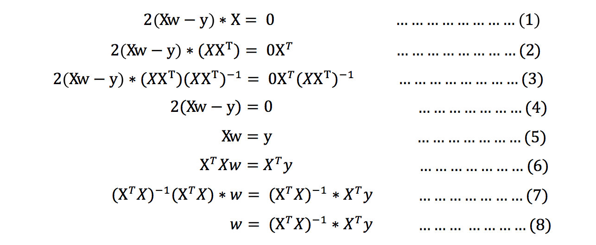
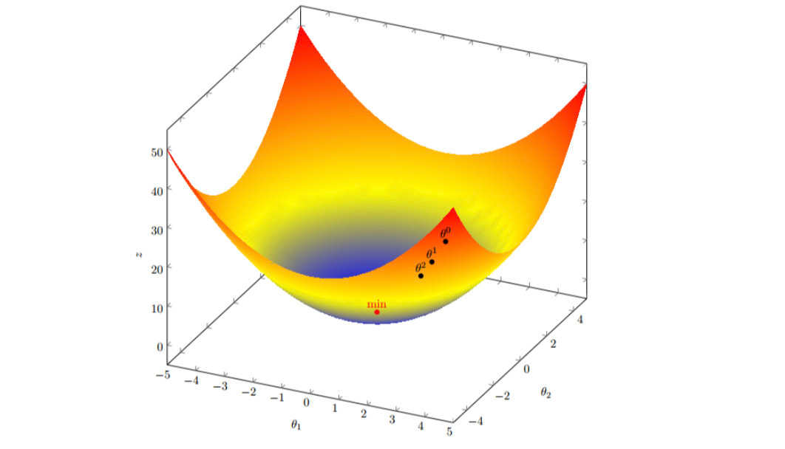

# 线性回归
> 线性回归(Linear regression): 利用回归方程(函数)对一个或多个自变量(特征值)和因变量(目标值)之间关系进行建模的一种分析方式。


## 线性回归的特征与目标的关系分析
- 线性回归当中主要有两种模型
    - 线性关系
    - 非线性关系


## 线性回归api初步使用
- sklearn.linear_model.LinearRegression()
    - LinearRegression.coef_：回归系数
    
- 1.获取数据集
- 2.数据基本处理（该案例中省略）
- 3.特征工程（该案例中省略）
- 4.机器学习
- 5.模型评估（该案例中省略）


```angular2html
from sklearn.linear_model import LinearRegression

x = [[80, 86],
[82, 80],
[85, 78],
[90, 90],
[86, 82],
[82, 90],
[78, 80],
[92, 94]]
y = [84.2, 80.6, 80.1, 90, 83.2, 87.6, 79.4, 93.4]

# 实例化API
estimator = LinearRegression()
# 使用fit方法进行训练
estimator.fit(x,y)

estimator.coef_

estimator.predict([[100, 80]])
```
## 导数


## 线性回归的损失和优化

### 损失函数

- 最小二乘法

  
### 优化算法
- 1.方程求解
- 2.梯度下降

#### 正规方程

- 理解：X为特征值矩阵，y为目标值矩阵。直接求到最好的结果

- 缺点：当特征过多过复杂时，求解速度太慢并且得不到结果

例子:


证明1:


其中y是真实值矩阵，X是特征值矩阵，w是权重矩阵

对其求解关于w的最小值，起止y,X 均已知二次函数直接求导，导数为零的位置，即为最小值。

求导：


注意: 式(1)到式(2)推导过程中, X是一个m行n列的矩阵，并不能保证其有逆矩阵，但是右乘X^T把其变成一个方阵，保证其有逆矩阵。

证明2:


#### 梯度下降


- 在单变量的函数中，梯度其实就是函数的微分，代表着函数在某个给定点的切线的斜率；

- 在多变量函数中，梯度是一个向量，向量有方向，梯度的方向就指出了函数在给定点的上升最快的方向；

梯度下降公式:


梯度下降,单变量:


梯度下降,多变量:





学习率的选择:


有了梯度下降这样一个优化算法，回归就有了"自动学习"的能力


## 梯度下降和方程对比


- 1.方程中 X^T*X可能不可逆,方程无法求解.不可逆是 x 中存在冗余数据导致的,删除冗余数据就可以
- 2.如果 X 的属性超过 10000,X^T*X的逆矩阵求解就过于复杂,建议用梯度下降.或者通过主成分分析降低特征的维度后再用最小二乘法。
- 3.如果拟合函数不是线性的，这时无法使用最小二乘法，需要通过一些技巧转化为线性才能使用，此时梯度下降仍然可以用

除此之外,还有一些特殊情况
- 1. 当样本量m很少，小于特征数n的时候，这时拟合方程是欠定的，常用的优化方法都无法去拟合数据。
- 2. 当样本量m等于特征数n的时候，用方程组求解就可以了。
- 3. 当m大于n时，拟合方程是超定的，也就是我们常用与最小二乘法的场景了。

### 算法选择依据
- 1.小规模数据
  - 1. 正规方程：LinearRegression(不能解决拟合问题)
  - 2. 岭回归

- 2.大规模数据,通常都是梯度下降  
  
### 总结
- 1.最小二乘法
- 2.回归优化算法
  - 1.方程
  - 2.梯度下降
- 3.正规方程
  - 1. 利用矩阵的逆,转置进行一步求解
  - 2. 适合于样本和特征比较少的情况
- 4.梯度下降
  - 梯度的概念(单变量,多变量)
- 5.梯度下降中的参数
  - 1.学习率
  - 2.公式中的负号
- 6.梯度下降和正规方程,如何选择
  - 1. 小规模数据,用方程(无法解决拟合问题)和岭回归
  - 2. 大规模数据,梯度下降


