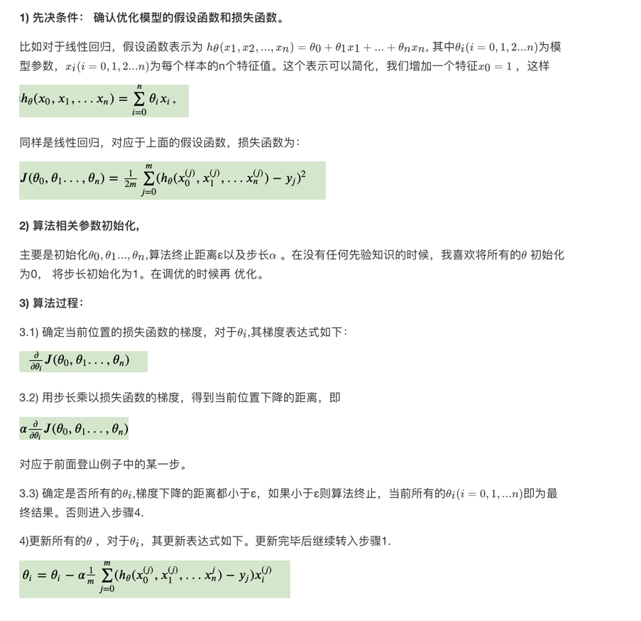
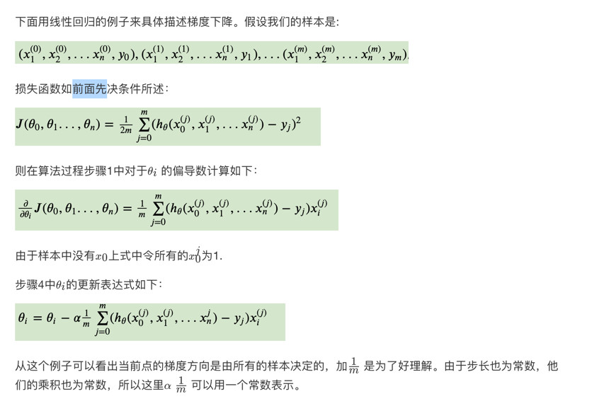
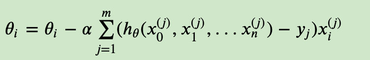
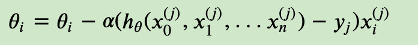
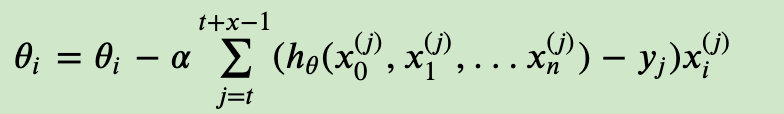
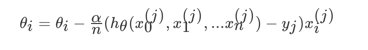

# 梯度下降

- 掌握梯度下降法的推导过程
- 知道全梯度下降算法的原理
- 知道随机梯度下降算法的原理
- 知道随机平均梯度下降算法的原理
- 知道小批量梯度下降算法的原理

## 相关基本概念

- 步长(Learning rate)
- 特征(feature)
- 假设函数(hypothesis function)
- 损失函数(loss function)

## 算法描述

## 梯度下降算法家族

- 全梯度下降算法(Full gradient descent)
- 随机梯度下降算法(Stochastic gradient descent)
- 小批量梯度下降算法(Mini-batch gradient descent)
- 随机平均梯度下降算法(Stochastic average gradient descent)

### 全梯度下降算法(Full gradient descent),
一次用所有的数据做梯度下降

缺点:
- 1.速度慢
- 2.内存压力大
- 3.批梯度下降法同样也不能在线更新模型，即在运行的过程中，不能增加新的样本。

### 随机梯度下降算法(SG)

每次只代入计算一个样本目标函数的梯度来更新权重，再取下一个样本重复此过程，直到损失函数值停止下降或损失函数值小于某个可以容忍的阈值。

- 优点:速度快
- 缺点:SG每次只使用一个样本迭代，若遇上噪声则容易陷入局部最优解

### 小批量梯度下降算法(mini-batch)
每次从训练样本集上随机抽取一个小样本集，在抽出来的小样本集上采用FG迭代更新权重。

若batch_size=1，则变成了SG；若batch_size=n，则变成了FG

### 随机平均梯度下降算法(SAG)
在SG方法中，虽然避开了运算成本大的问题，但对于大数据训练而言，SG效果常不尽如人意，因为每一轮梯度更新都完全与上一轮的数据和梯度无关。

随机平均梯度算法克服了这个问题，在内存中为每一个样本都维护一个旧的梯度，随机选择第i个样本来更新此样本的梯度，其他样本的梯度保持不变，然后求得所有梯度的平均值，进而更新了参数

- 我们知道sgd是当前权重减去步长乘以梯度，得到新的权重。sag中的a，就是平均的意思，具体说，就是在第k步迭代的时候，我考虑的这一步和前面n-1个梯度的平均值，当前权重减去步长乘以最近n个梯度的平均值。
  
- n是自己设置的，当n=1的时候，就是普通的sgd。
  
- 这个想法非常的简单，在随机中又增加了确定性，类似于mini-batch sgd的作用，但不同的是，sag又没有去计算更多的样本，只是利用了之前计算出来的梯度，所以每次迭代的计算成本远小于mini-batch sgd，和sgd相当。效果而言，sag相对于sgd，收敛速度快了很多。这一点下面的论文中有具体的描述和证明。

论文：https://arxiv.org/pdf/1309.2388.pdf

