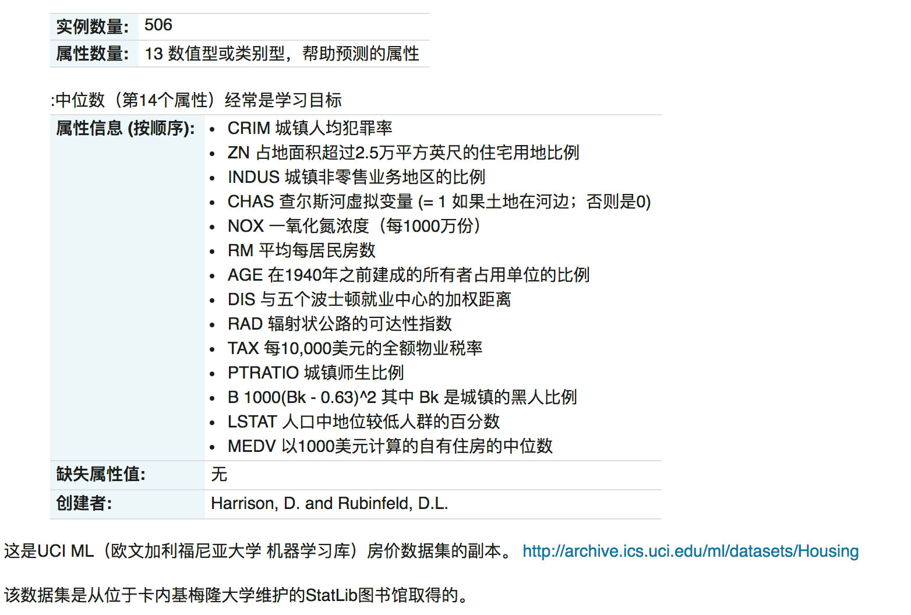
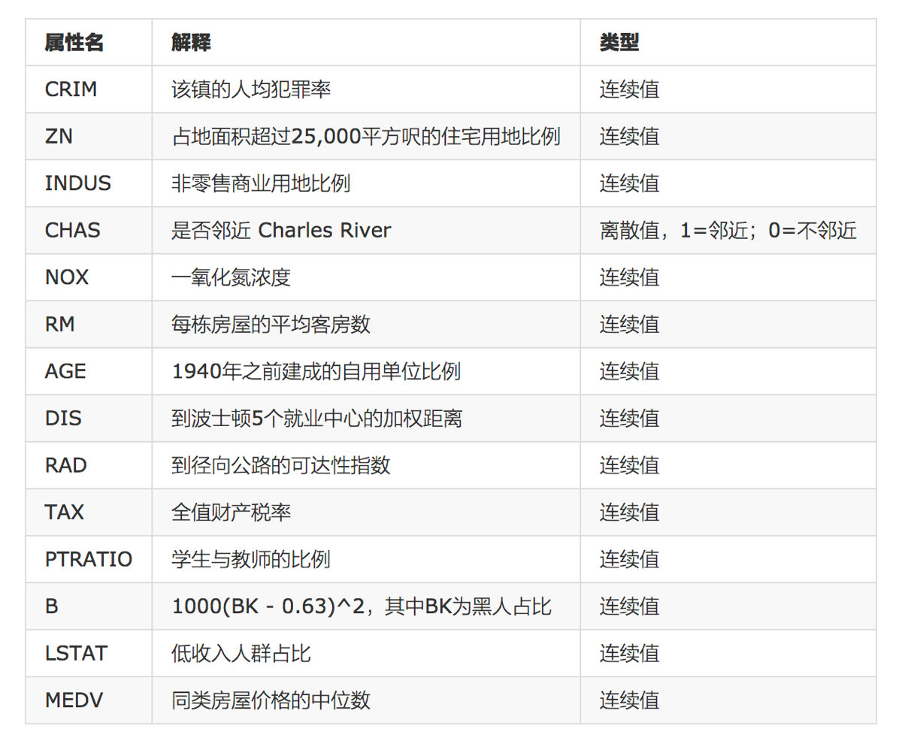
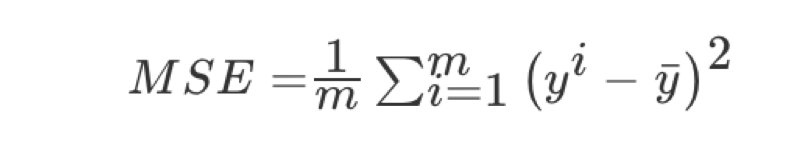

通过案例掌握正规方程和梯度下降法api的使用

# 案例背景介绍

# 案例分析
- 回归当中的数据大小不一致，是否会导致结果影响较大。所以需要做标准化处理。
    - 数据分割与标准化处理
    - 回归预测
    - 线性回归的算法效果评估
    
# 性能评估

均方误差(Mean Squared Error)MSE)评价机制：

- sklearn.metrics.mean_squared_error(y_true, y_pred)
    - 均方误差回归损失
    - return:浮点数结果

