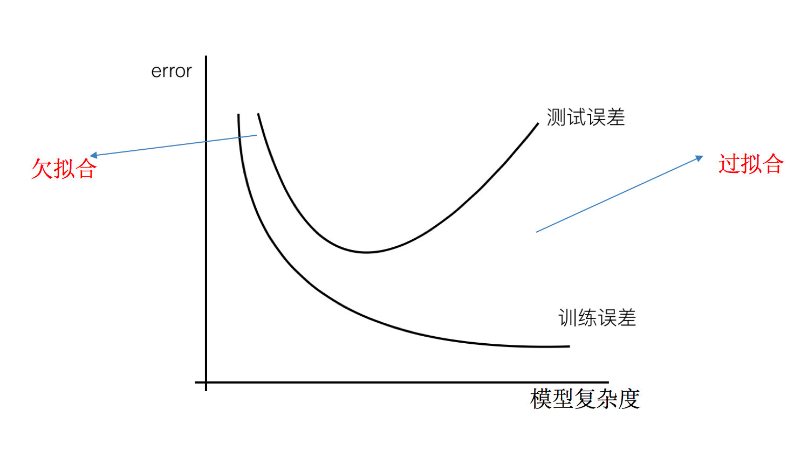
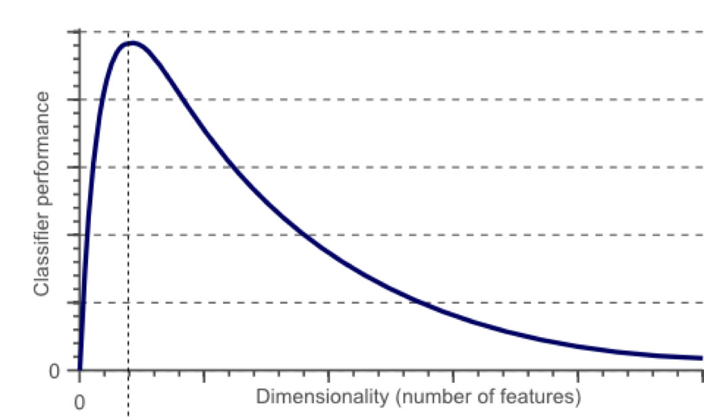
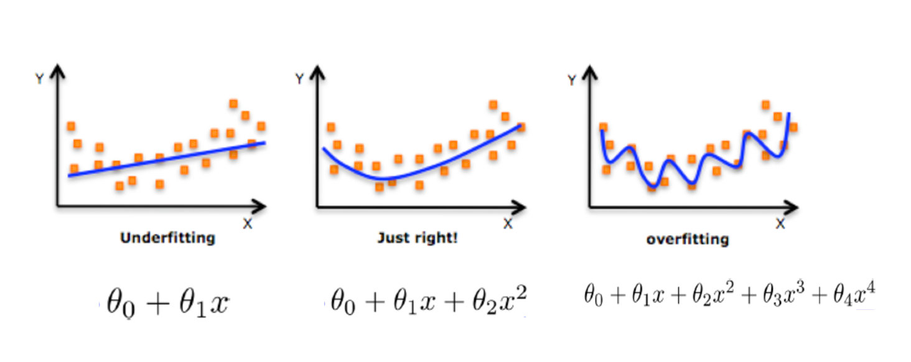

# 欠拟合和过拟合
- 过拟合:训练集上效果好,测试集上效果差(模型过于复杂)
- 欠拟合:训练集测试集效果都很差(模型太简单)

# 原因以及解决办法
## 欠拟合原因以及解决办法
- 原因：学习到数据的特征过少
- 解决方法
    - 继续训练模型
    - 添加其他特征项
    - 添加多项式特征
    

## 过拟合的原因和解决方法
- 原始特征过多，存在一些嘈杂特征， 模型过于复杂是因为模型尝试去兼顾各个测试数据点
- 解决方法
     - 重新清洗数据,删除冗余和噪声数据
     - 增大训练集的数据量
     - 正则化
     - 降低纬度,减少特征,防止维灾难
    
- 什么是维灾难

# 正则化
## 什么是正则化

数据提供的特征有些影响模型复杂度或者这个特征的数据点异常较多，所以算法在学习的时候尽量减少这个特征的影响（甚至删除某个特征的影响），这就是正则化

实际上就是通过限制高次项的系数的大小,防止模型太复杂
## 正则化分类
- L2正则
    - 作用:可以使得其中一些W的都很小，都接近于0，削弱某个特征的影响
    - 越小的参数说明模型越简单，越简单的模型则越不容易产生过拟合现象
    - Ridge回归

- L1 正则
    - 作用：可以使得其中一些W的值直接为0，删除这个特征的影响
    - LASSO回归

