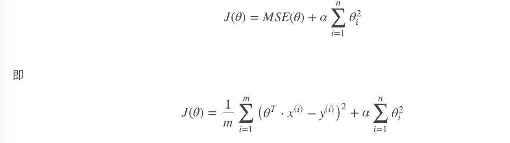
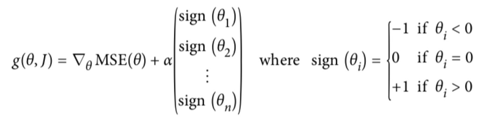

# 正则化线性模型

- Ridge Regression 岭回归
- Lasso 回归
- Elastic Net 弹性网络
- Early stopping

## Ridge Regression (岭回归，又名 Tikhonov regularization)
岭回归是线性回归的正则化版本，即在原来的线性回归的 cost function 中添加正则项



- α=0：岭回归退化为线性回归

## Lasso Regression(Lasso 回归)

Lasso 回归是线性回归的另一种正则化版本，正则项为权值向量的L 1范数。


- Lasso Regression 的代价函数在 θi=0处是不可导的.
- 解决方法：在θ=0处用一个次梯度向量(subgradient vector)代替梯度，如下式
- Lasso Regression 的次梯度向量

  
Lasso Regression 有一个很重要的性质是：倾向于完全消除不重要的权重。

例如：当α 取值相对较大时，高阶多项式退化为二次甚至是线性：高阶多项式特征的权重被置为0。

也就是说，Lasso Regression 能够自动进行特征选择，并输出一个稀疏模型（只有少数特征的权重是非零的）。


## Elastic Net (弹性网络)


- r=0：弹性网络变为岭回归
- r=1：弹性网络便为Lasso回归


## 总结
- 我们应避免使用朴素线性回归，而应对模型进行一定的正则化处理，那如何选择正则化方法呢
- 常用：岭回归 L2
- 假设只有少部分特征是有用的：
    - 弹性网络
    - Lasso: L1
    - 一般来说，弹性网络的使用更为广泛。因为在特征维度高于训练样本数，或者特征是强相关的情况下，Lasso回归的表现不太稳定

api:
```angular2html
from sklearn.linear_model import Ridge, ElasticNet, Lasso
```

## Early Stopping [了解]
- 在验证错误率达到最小值的时候停止训练

## 总结
- Ridge Regression 岭回归
    - 就是把系数添加平方项
    - 然后限制系数值的大小
    - α值越小，系数值越大，α越大，系数值越小
- Lasso 回归
    - 对系数值进行绝对值处理
    - 由于绝对值在顶点处不可导，所以进行计算的过程中产生很多0，最后得到结果为：稀疏矩阵
- Elastic Net 弹性网络
    - 设置了一个r,如果r=0--岭回归；r=1--Lasso回归
- Early stopping: 通过限制错误率的阈值，进行停止


