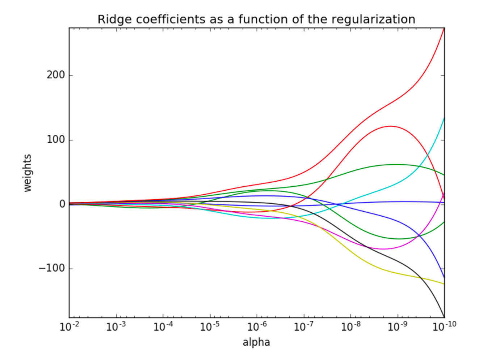

# 岭回归
- sklearn.linear_model.Ridge(alpha=1.0, fit_intercept=True,solver="auto", normalize=False)
    - 具有l2正则化的线性回归
    - alpha:正则化力度 [0,10]
    - solver:会根据数据自动选择优化方法,默认是sag,如果数据集和特征都很大,就是随机梯度下降
    - normalize:数据是否进行标准化,normalize=False:可以在fit之前调用preprocessing.StandardScaler标准化数据
    - Ridge.coef_:回归权重
    - Ridge.intercept_:回归偏置

- Ridge方法相当于SGDRegressor(penalty='l2', loss="squared_loss"),只不过SGDRegressor实现了一个普通的随机梯度下降学习，推荐使用Ridge(实现了SAG随机平均梯度下降)

- sklearn.linear_model.RidgeCV(_BaseRidgeCV, RegressorMix
    - 具有l2正则化的线性回归，可以进行交叉验证
    - coef_:回归系数

```angular2html
class _BaseRidgeCV(LinearModel):
    #选择不同的惩罚系数
    def __init__(self, alphas=(0.1, 1.0, 10.0),
                 fit_intercept=True, normalize=False,scoring=None,
                 cv=None, gcv_mode=None,
                 store_cv_values=False):
```

## 观察正则化程度的变化，对结果的影响？

- 正则化力度越大，权重系数会越小
- 正则化力度越小，权重系数会越大



```angular2html
def linear_model3():
    """
    线性回归:岭回归
    :return:
    """
    # 1.获取数据
    data = load_boston()

    # 2.数据集划分
    x_train, x_test, y_train, y_test = train_test_split(data.data, data.target, random_state=22)

    # 3.特征工程-标准化
    transfer = StandardScaler()
    x_train = transfer.fit_transform(x_train)
    x_test = transfer.fit_transform(x_test)

    # 4.机器学习-线性回归(岭回归)
    estimator = Ridge(alpha=1)
    # estimator = RidgeCV(alphas=(0.1, 1, 10))
    estimator.fit(x_train, y_train)

    # 5.模型评估
    # 5.1 获取系数等值
    y_predict = estimator.predict(x_test)
    print("预测值为:\n", y_predict)
    print("模型中的系数为:\n", estimator.coef_)
    print("模型中的偏置为:\n", estimator.intercept_)

    # 5.2 评价
    # 均方误差
    error = mean_squared_error(y_test, y_predict)
    print("误差为:\n", error)
```


