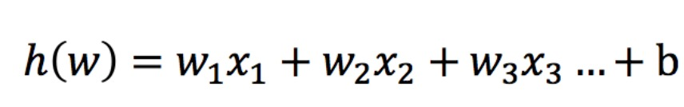
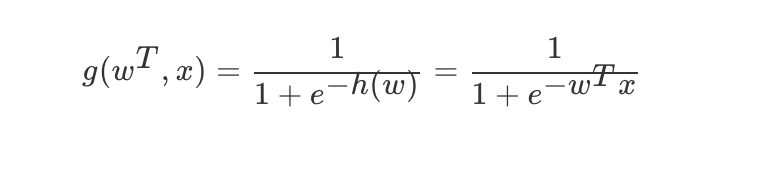
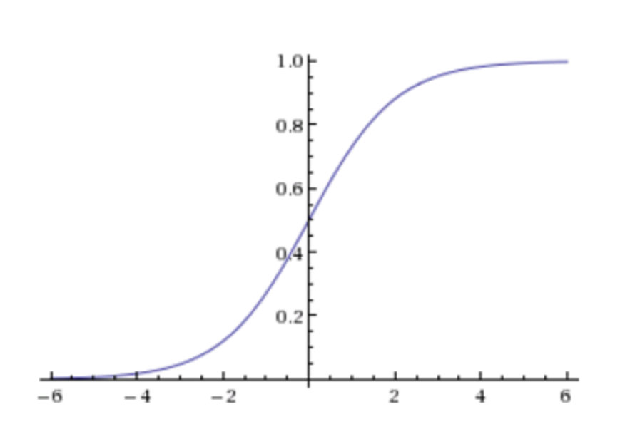
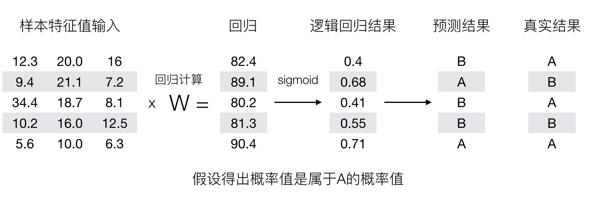
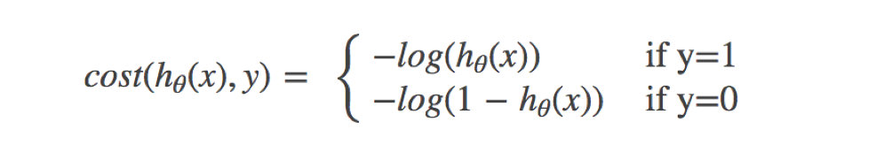
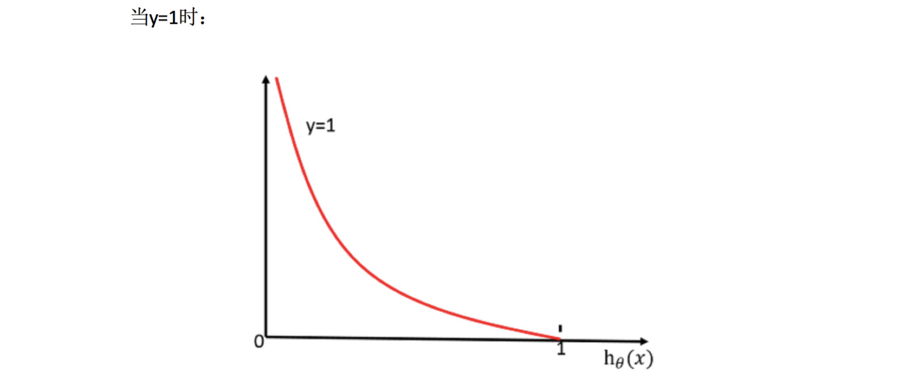
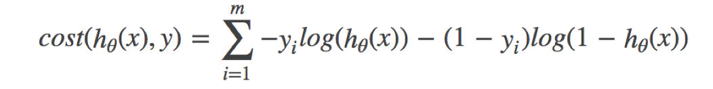
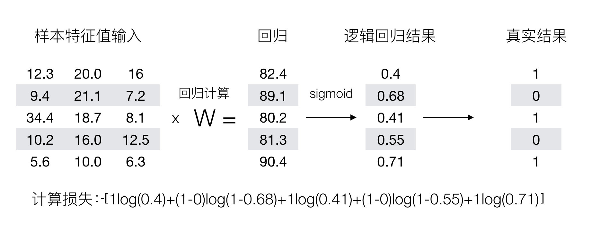

# 学习目标
- 知道逻辑回归的损失函数、优化方法
- 知道逻辑回归的应用场景
- 应用LogisticRegression实现逻辑回归预测
- 知道精确率、召回率等指标的区别
- 知道如何解决样本不均衡情况下的评估
- 会绘制ROC曲线图形

# 逻辑回归的原理
- 逻辑回归（Logistic Regression）是机器学习中的一种分类模型

## 逻辑回归的输入:

## 激活函数:sigmoid函数
    - 回归的结果输入到sigmoid函数当中
    - 输出结果：[0, 1]区间中的一个概率值，默认为0.5为阈值

- 我们来看下图(下图中，设置阈值为0.6)，

## 损失以及优化

### 对数似然损失
其中 y 为真实值,h(x)是预测值

- 我们希望损失函数越小越好
    - 当y=1时，我们希望h(x)值越大越好；
    - 当y=0时，我们希望h(x)值越小越好；
    
综合完整损失函数:

- 我们已经知道，-log(P), P值越大，结果越小，所以我们可以对着这个损失的式子去分析

## 逻辑回归 API
- sklearn.linear_model.LogisticRegression(solver='liblinear', penalty=‘l2’, C = 1.0)
    - solver可选参数:{'liblinear', 'sag', 'saga','newton-cg', 'lbfgs'}，
        - 默认: 'liblinear'；用于优化问题的算法。
        - 对于小数据集来说，“liblinear”是个不错的选择，而“sag”和'saga'对于大型数据集会更快。
        - 对于多类问题，只有'newton-cg'， 'sag'， 'saga'和'lbfgs'可以处理多项损失;“liblinear”仅限于“one-versus-rest”分类。
    - penalty：正则化的种类
    - C：正则化力度
    
注意:
LogisticRegression方法相当于 SGDClassifier(loss="log", penalty=" "),SGDClassifier实现了一个普通的随机梯度下降学习。而使用LogisticRegression(实现了SAG)

## 总结
- 逻辑回归概念
    - 解决的是一个二分类问题
    - 逻辑回归的输入是线性回归的输出
    - 输入:线性回归的输出
    - 输出:用 sigmod 函数激活,把整体的值映射到[0,1],再设置一个阈值，进行分类判断
- 逻辑回归的损失和优化
    - 对数似然损失
    - 借助了log思想，进行完成
    - 真实值等于0，等于1两种情况进行划分
    - 提升原本属于1类别的概率，降低原本是0类别的概率

