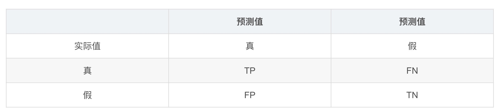
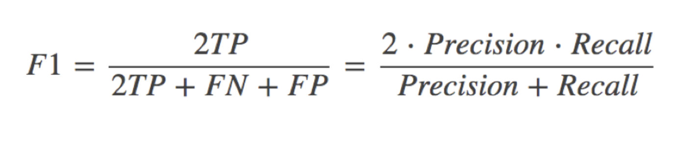
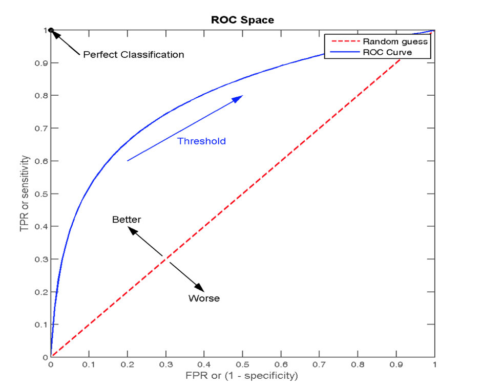

# 学习目标
- 了解什么是混淆矩阵
- 知道分类评估中的精确率和召回率
- 知道roc曲线和auc指标

# 混淆矩阵

## accuracy
accuracy = (TP+TN)/all

## precision
precision = TP/(TP + FP)

## recall 
recall = TP/(TP+FN)

## F1-score

## 分类评估报告api

- sklearn.metrics.classification_report(y_true, y_pred, labels=[], target_names=None)
    - y_true：真实目标值
    - y_pred：估计器预测目标值
    - labels:指定类别对应的数字
    - target_names：目标类别名称
    - return：每个类别精确率与召回率

# ROC曲线与AUC指标

## TPR与FPR

- TPR = TP / (TP + FN), 有真实类别为1的样本中，预测类别为1的比例
- FPR = FP / (FP + TN), 所有真实类别为0的样本中，预测类别为1的比例

## ROC曲线
- ROC曲线的横轴就是FPRate，纵轴就是TPRate，当二者相等时，表示的意义则是：对于不论真实类别是1还是0的样本，分类器预测为1的概率是相等的，此时AUC为0.5

## AUC
- AUC的概率意义是随机取一对正负样本，正样本得分大于负样本得分的概率
- AUC的范围在[0, 1]之间，并且越接近1越好，越接近0.5属于乱猜
- AUC=1，完美分类器，采用这个预测模型时，不管设定什么阈值都能得出完美预测。绝大多数预测的场合，不存在完美分类器。
- 0.5<AUC<1，优于随机猜测。这个分类器（模型）妥善设定阈值的话，能有预测价值。

## AUC计算API
- from sklearn.metrics import roc_auc_score
- sklearn.metrics.roc_auc_score(y_true, y_score)
    - 计算ROC曲线面积，即AUC值
    - y_true：每个样本的真实类别，必须为0(反例),1(正例)标记
    - y_score：预测得分，可以是正类的估计概率、置信值或者分类器方法的返回值

- AUC只能用来评价二分类
- AUC非常适合评价样本不平衡中的分类器性能

