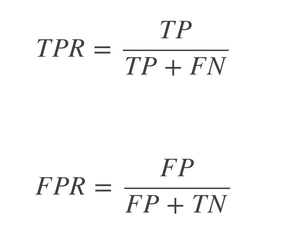
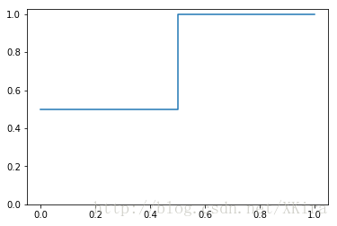

- FPR（False Positive Rate）和TPR（True Positive Rate）分别对应着ROC曲线的横纵坐标
- 对于一个学习器它的预测结果只能产生一对（FPR，TPR），这只能绘制一个点，不足以绘制出一条曲线
- 对于许多学习器在判定二分类问题时是预测出一个对于真值的范围在[0.0, 1.0]之间的概率值
- 而判定是否为真值则看该概率值是否大于设定的阈值（Threshold),通过设置不同的Threshold,就可以得到不同的（FPR，TPR）.

例如:
- y_true = [0, 1, 0, 1]
- y_score = [0.1, 0.35, 0.4, 0.8]
- 分别取4组判定正例用的阈值：[0.1, 0.35, 0.4, 0.8]，可得相应4组FPR,TPR
- TPR: [1, 1, 0.5, 0.5]
- FPR: [1, 0.5, 0.5, 0]

ROC曲线所覆盖的面积称为AUC（Area Under Curve），可以更直观的判断学习器的性能，AUC越大则性能越好。一个瞎猜的分类器 auc=0.5.对于该例的AUC值为0.75。

- ROC曲线的绘制
    - 1.构建模型，把模型的概率值从大到小进行排序
    - 2.从概率最大的点开始取值，一直进行tpr和fpr的计算，然后构建整体模型，得到结果
    - 3.其实就是在求解积分（面积）

