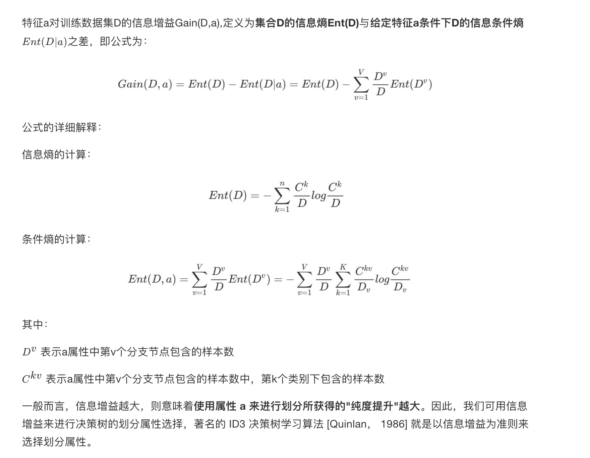

- 重点:
    - 知道如何求解信息熵
    - 知道信息增益的求解过程
    - 知道信息增益率的求解过程
    - 知道基尼系数的求解过程
    - 知道信息增益、信息增益率和基尼系数三者之间的区别、联系

# 信息熵:

- 信息熵定义:"信息熵" (information entropy)是度量样本集合纯度最常用的一种指标。
    - 从信息的完整性上进行的描述:
        - 当系统的有序状态一致时，数据越集中的地方熵值越小，数据越分散的地方熵值越大。
    - 从信息的有序性上进行的描述:
        - 当数据量一致时，系统越有序，熵值越低；系统越混乱或者分散，熵值越高.

> 假设我们没有看世界杯的比赛，但是想知道哪支球队会是冠军，
我们只能猜测某支球队是或不是冠军，然后观众用对或不对来回答，
我们想要猜测次数尽可能少，你会用什么方法？

答案：
二分法：
> 假如有 16 支球队，分别编号，先问是否在 1-8 之间，如果是就继续问是否在 1-4 之间，
> 以此类推，直到最后判断出冠军球队是哪支。
> 如果球队数量是 16，我们需要问 4 次来得到最后的答案。那么世界冠军这条消息的信息熵就是 4。

> 那么信息熵等于4，是如何进行计算的呢？
> Ent(D) = -（p1 * logp1 + p2 * logp2 + ... + p16 * logp16），
> 其中 p1, ..., p16 分别是这 16 支球队夺冠的概率。
> 当每支球队夺冠概率相等都是 1/16 的时：Ent(D) = -（16 * 1/16 * log1/16） = 4
> 每个事件概率相同时，熵最大，这件事越不确定。

# 信息增益
信息增益：以某特征划分数据集前后的熵的差值。熵可以表示样本集合的不确定性，熵越大，样本的不确定性就越大。因此可以使用划分前后集合熵的差值来衡量使用当前特征对于样本集合D划分效果的好坏。

信息增益 = entroy(前) - entroy(后)

案例:

# 信息增益率
> 信息增益准则对可取值数目较多的属性有所偏好，为减少这种偏好可能带来的不利影响，著名的 C4.5 决策树算法 [Quinlan， 1993J 不直接使用信息增益，而是使用"增益率" (gain ratio) 来选择最优划分属性.

>第一个例子:

- 信息增益率优于信息增益
    - 克服了用信息增益来选择属性时偏向选择值多的属性的不足
    - 避免树的高度无节制的增长，避免过度拟合数据
    - 对于缺失值的处理
        - 处理缺少属性值的一种策略是赋给它结点n所对应的训练实例中该属性的最常见值
        - 更复杂的策略是为A的每个可能值赋予一个概率
    

# 基尼值和基尼指数

- 例子

# 总结

- ID3 算法
    - 缺点是倾向于选择取值较多的属性
    - 只能对属性为离散型属性的数据集构造决策树

- C4.5算法
    - 用信息增益率来选择属性
    - 可以处理连续数值型属性
    - 采用了一种后剪枝方法(需要先在内存中构造整颗树,然后再剪枝,非常吃内存)
    - 对于缺失值的处理
    - 在构造树的过程中，需要对数据集进行多次的顺序扫描和排序，因而导致算法的低效

- CART算法
    - 采用了简化的二叉树模型，同时特征选择采用了近似的基尼系数来简化计算。
    
- 多变量决策树(multi-variate decision tree)
    - 无论是ID3, C4.5还是CART,在做特征选择的时候都是选择最优的一个特征来做分类决策，但是大多数，分类决策不应该是由某一个特征决定的，而是应该由一组特征决定的
    - 多变量决策树不是选择某一个最优特征，而是选择最优的一个特征线性组合来做决策。这个算法的代表是OC1

- 决策树变量的两种类型：
    - 数字型（Numeric）：变量类型是整数或浮点数
    - 名称型（Nominal）：类似编程语言中的枚举类型
    
# 剪枝

出现过拟合的原因
- 原因1：噪声、样本冲突，即错误的样本数据。
- 原因2：特征即属性不能完全作为分类标准。
- 原因3：巧合的规律性，数据量不够大。

## 预剪枝和后剪枝

预剪枝

后剪枝

- 后剪枝决策树通常比预剪枝决策树保留了更多的分支。
- 一般情形下，后剪枝决策树的欠拟合风险很小，泛化性能往往优于预剪枝决策树。
- 但后剪枝过程是在生成完全决策树之后进行的。 并且要自底向上地对树中的所有非叶结点进行逐一考察，因此其训练时间开销比未剪枝决策树和预剪枝决策树都要大得多.

    