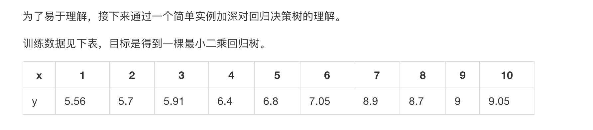

# 回归决策树

- 决策树分类
    - 分类决策树
    - 回归决策树
    
    
- 决策树两个核心问题：
    - 如何选择划分点？
    - 如何决定叶节点的输出值？
    
## 算法描述
  
    
## 简单例子
  
     
  
    
    
    
    
    
    
    
    
    
    
    
    
    
    
    
    
    
    
    
    
    
    
    
    
    