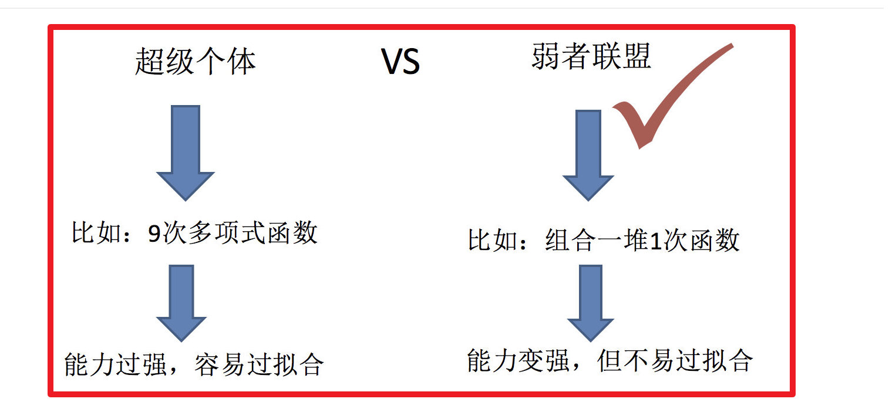
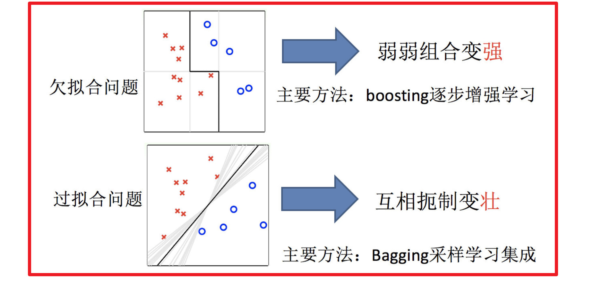

# 集成学习

## 什么是集成学习

 
集成学习通过建立几个模型来解决单一预测问题。它的工作原理是生成多个分类器/模型，各自独立地学习和作出预测。这些预测最后结合成组合预测，因此优于任何一个单分类的做出预测。

## 机器学习的核心任务
- 如何优化训练数据 —> 主要用于解决欠拟合问题
- 如何提升泛化性能 —> 主要用于解决过拟合问题

## 集成学习中boosting和Bagging
 

## 小节

- 什么是集成学习【了解】
    - 通过建立几个模型来解决单一预测问题
- 机器学习两个核心任务【知道】
    - 1.解决欠拟合问题,弱弱组合变强,boosting
    - 2.解决过拟合问题,互相遏制变壮,Bagging

 