# Boosting

## 什么是boosting
随着学习的积累从弱到强

简而言之：每新加入一个弱学习器，整体能力就会得到提升

代表算法：Adaboost，GBDT，XGBoost，LightGBM

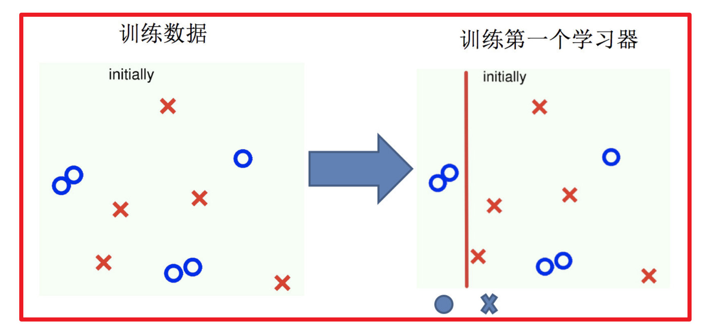 
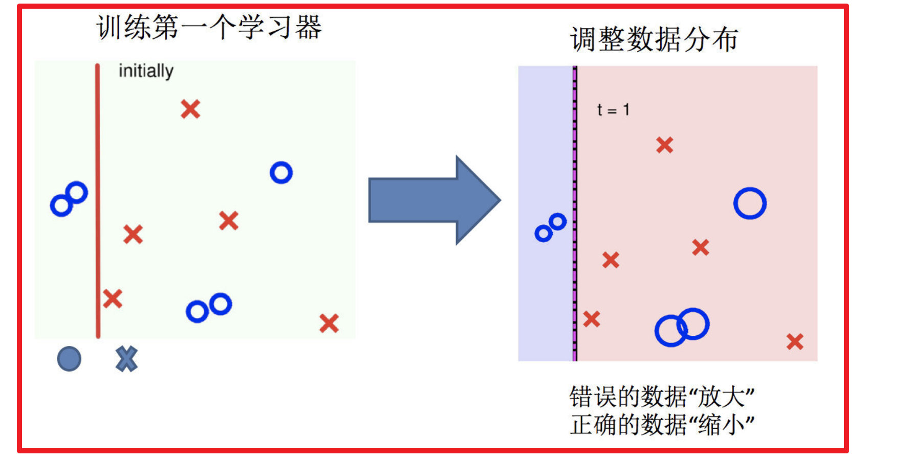 
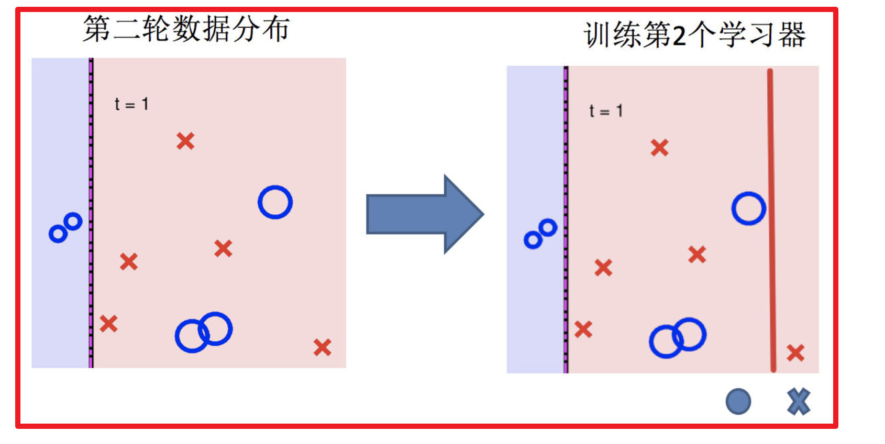 
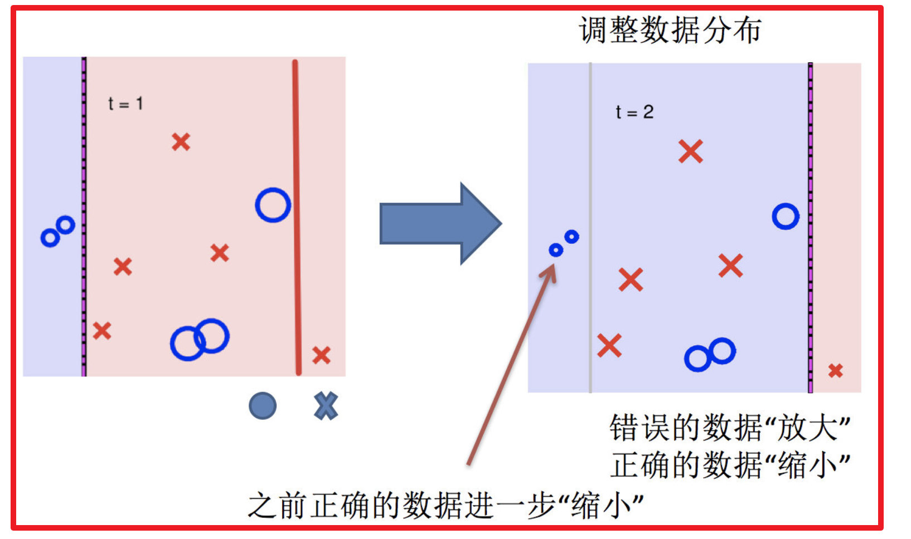 
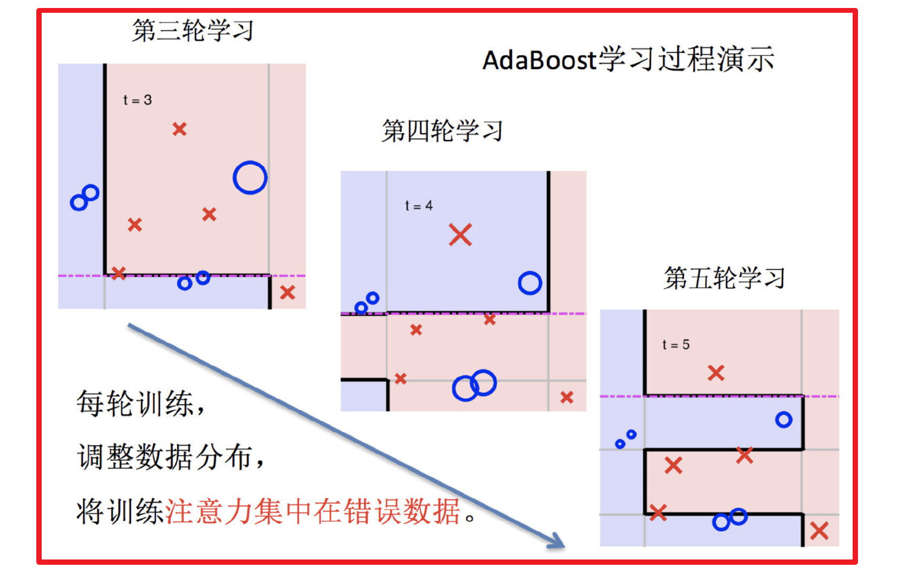 
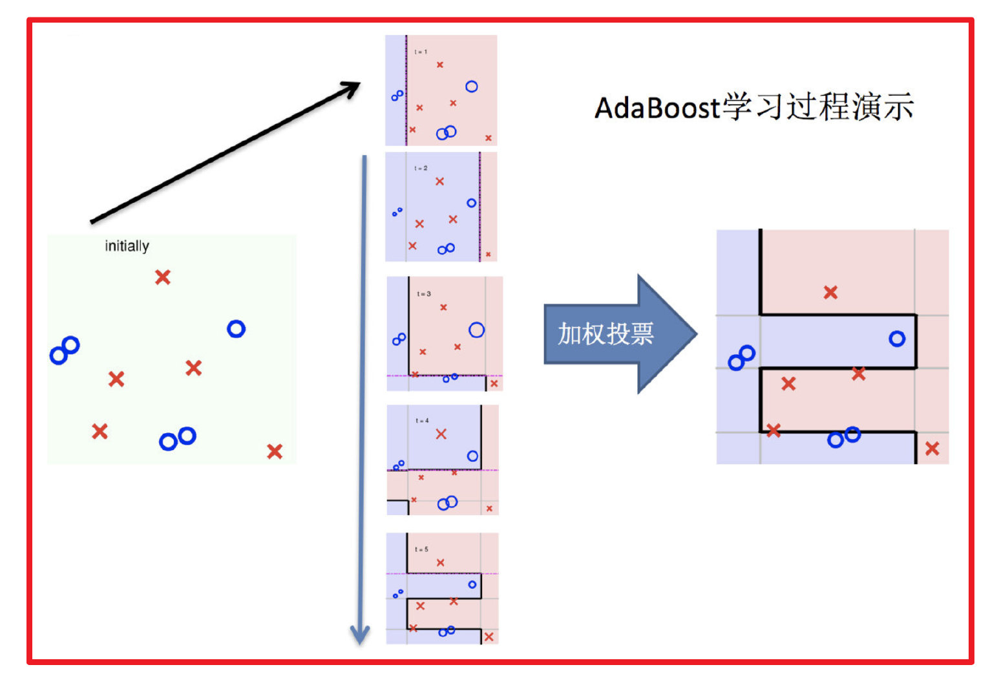 

## bagging集成与boosting集成的区别：
- 1:数据方面
    - Bagging：对数据进行采样训练；
    - Boosting：根据前一轮学习结果调整数据的重要性。
- 2:投票方面
    - Bagging：所有学习器平权投票；
    - Boosting：对学习器进行加权投票。
- 3:学习顺序
    - Bagging的学习是并行的，每个学习器没有依赖关系；
    - Boosting学习是串行，学习有先后顺序。
- 4:主要作用
    - Bagging主要用于提高泛化性能（解决过拟合，也可以说降低方差）
    - Boosting主要用于提高训练精度 （解决欠拟合，也可以说降低偏差）

 

## AdaBoost介绍
### 构造过程细节
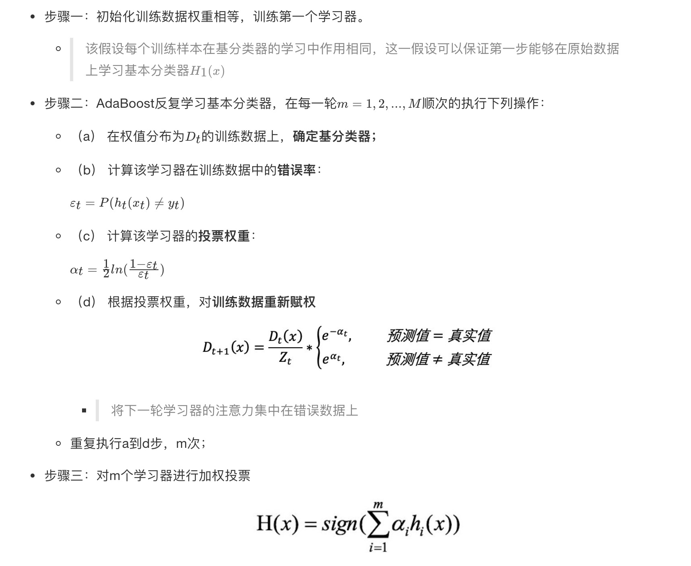 

## 关键点剖析

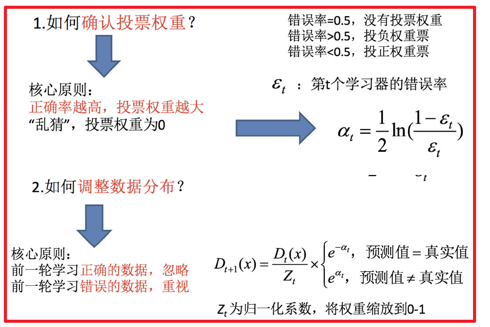 

## 案例分析

 
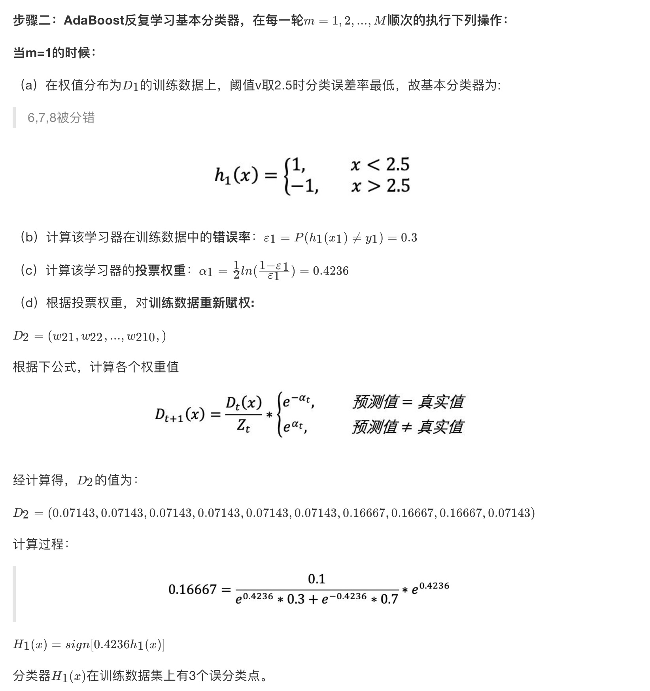 
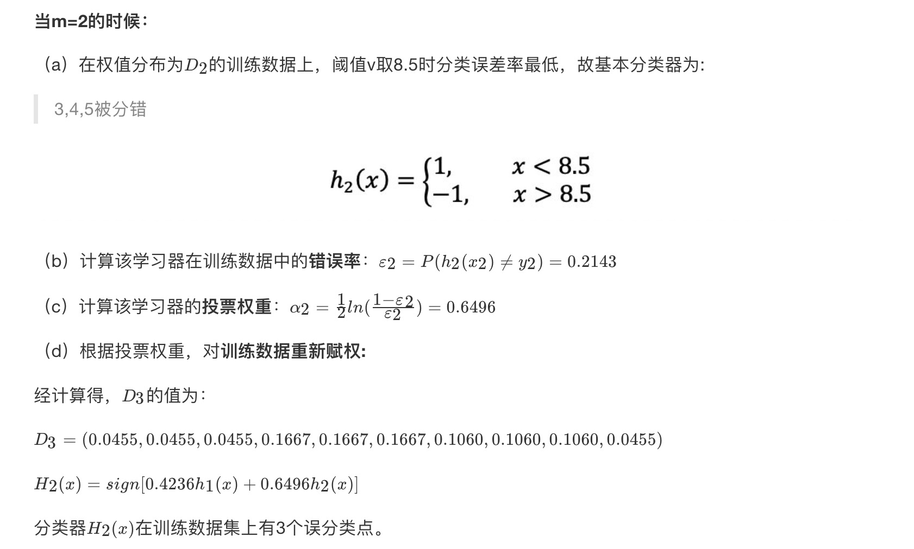 
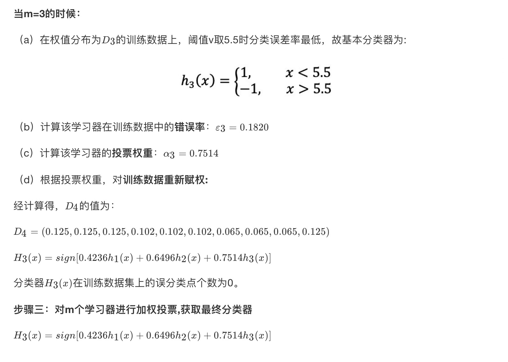 

## api介绍
- from sklearn.ensemble import AdaBoostClassifier
    - api链接:https://scikit-learn.org/stable/modules/generated/sklearn.ensemble.AdaBoostClassifier.html#sklearn.ensemble.AdaBoostClassifier

## 小结
- 什么是Boosting 【知道】
    - 随着学习的积累从弱到强
    - 代表算法：Adaboost，GBDT，XGBoost，LightGBM

- bagging集成与boosting集成的区别：
    - 1:数据方面
        - Bagging：对数据进行采样训练；
        - Boosting：根据前一轮学习结果调整数据的重要性。
    - 2:投票方面
        - Bagging：所有学习器平权投票；
        - Boosting：对学习器进行加权投票。
    - 3:学习顺序
        - Bagging的学习是并行的，每个学习器没有依赖关系；
        - Boosting学习是串行，学习有先后顺序。
    - 4:主要作用
        - Bagging主要用于提高泛化性能（解决过拟合，也可以说降低方差）
        - Boosting主要用于提高训练精度 （解决欠拟合，也可以说降低偏差）

- AdaBoost构造过程【知道】
    - 步骤一：初始化训练数据权重相等，训练第一个学习器;
    - 步骤二：AdaBoost反复学习基本分类器;
    - 步骤三：对m个学习器进行加权投票

