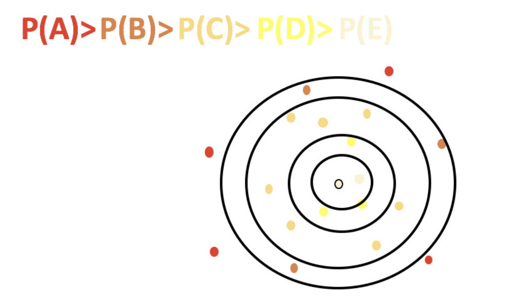

# 算法优化
- 知道k-means算法的优缺点
- 了解K-means++、二分K-means、K-medoids的优化原理
- 了解kernel K-means、ISODATA、Mini-batch K-means的优化原理

## k-means算法小结
- 优点
    - 原理简单（靠近中心点），实现容易
    - 聚类效果中上（依赖K的选择）
    - 空间复杂度o(N)，时间复杂度o(IKN)
    
- 缺点
    - 对离群点，噪声敏感 （中心点易偏移）
    - 很难发现大小差别很大的簇及进行增量计算
    - 结果不一定是全局最优，只能保证局部最优（与K的个数及初值选取有关）
    
## K-means++

## 二分k-means
- 1.所有点作为一个簇

- 2.将该簇一分为二

- 3.选择能最大限度降低聚类代价函数（也就是误差平方和）的簇划分为两个簇。

- 4.以此进行下去，直到簇的数目等于用户给定的数目k为止。

注意:
- 因为聚类的误差平方和能够衡量聚类性能。所以需要对误差平方和最大的簇进行再一次划分，因为误差平方和越大，表示该簇聚类效果越不好，越有可能是多个簇被当成了一个簇，所以我们首先需要对这个簇进行划分。

- 二分K均值算法可以加速K-means算法的执行速度，因为它的相似度计算少了并且不受初始化问题的影响，因为这里不存在随机点的选取，且每一步都保证了误差最小

## k-medoids（k-中心聚类算法）

- K-medoids和K-means是有区别的，不一样的地方在于中心点的选取

- K-means中，将中心点取为当前cluster中所有数据点的平均值，对异常点很敏感!

- K-medoids中，将从当前cluster 中选取到其他所有（当前cluster中的）点的距离之和最小的点作为中心点。

- k-medoids对噪声鲁棒性好。

- k-medoids只能对小样本起作用，样本大，速度就太慢了，当样本多的时候，少数几个噪音对k-means的质心影响也没有想象中的那么重，所以k-means的应用明显比k-medoids多。

当一个cluster样本点只有少数几个，如（1,1）（1,2）（2,1）（1000,1000）。其中（1000,1000）是噪声。如果按照k-means质心大致会处在（1,1）（1000,1000）中间，这显然不是我们想要的。这时k-medoids就可以避免这种情况，他会在（1,1）（1,2）（2,1）（1000,1000）中选出一个样本点使cluster的绝对误差最小，计算可知一定会在前三个点中选取。

## Kernel k-means（了解）
kernel k-means实际上，就是将每个样本进行一个投射到高维空间的处理，然后再将处理后的数据使用普通的k-means算法思想进行聚类.

## ISODATA
- 动态确定质心

- “合并”：（当聚类结果某一类中样本数太少，或两个类间的距离太近时）

- “分裂”：（当聚类结果中某一类的类内方差太大，将该类进行分裂）

## Mini Batch K-Means

- 适合大数据的聚类算法
- Mini Batch计算过程中不必使用所有的数据样本，而是从不同类别的样本中抽取一部分样本来代表各自类型进行计算。由于计算样本量少，所以会相应的减少运行时间，但另一方面抽样也必然会带来准确度的下降

具体过程:
- 从数据集中随机抽取一些数据形成小批量，把他们分配给最近的质心
- 更新质心

## 总结
- kmeans++	距离越远越容易成为新的质心
- 二分k-means	拆除SSE最大的簇
- k-medoids	和kmeans选取中心点的方式不同
- kernel kmeans	映射到高维空间
- ISODATA	动态聚类，可以更改K值大小
- Mini-batch K-Means	大数据集分批聚类

